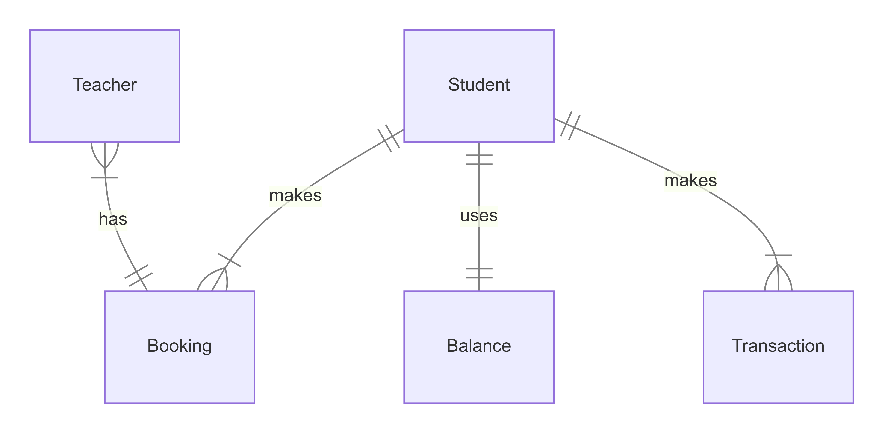

# Design Document

By Dmitrii Riabokon

Video overview: https://youtu.be/vuEXZ-5pYME

## Scope

The database for the Student-Teacher Booking System is designed to facilitate a comprehensive lesson booking and payment management platform for educational institutions or independent teachers. The system focuses on managing the financial and scheduling aspects of educational services, ensuring seamless coordination between students, teachers, and the administrative processes.

### Included in Scope:

* Student Management
    - Basic identifying information (first name, last name)
    - Financial account tracking
    - Booking history
    - Transaction history

* Teacher Management
    - Basic identifying information (first name, last name)
    - Lesson history
    - Student associations through bookings

* Booking Management
    - Lesson scheduling
    - Price tracking
    - Student-teacher pairing
    - Automatic financial processing

* Financial Operations
    - Student balance tracking
    - Automated payment processing
    - Transaction history
    - Refund handling for cancelled lessons

## Functional Requirements

The database system will support the following core functionalities:

### Student Management
* Create, read, update, and delete student profiles
* View student booking history
* Track student financial balance
* Monitor student transaction history
* Validate sufficient funds before booking

### Teacher Management
* Create, read, update, and delete teacher profiles
* View teacher booking schedule
* Track teacher-student associations
* Monitor teaching history

### Booking Operations
* Create new lesson bookings with automatic validation
* Cancel existing bookings with automatic refund processing
* View upcoming and past bookings
* Associate bookings with specific students and teachers
* Automatic financial processing upon booking creation/cancellation

### Financial Processing
* Maintain student balance accounts
* Process automatic payments for bookings
* Handle booking cancellation refunds
* Track all financial transactions
* Support manual balance adjustments (deposits)
* Ensure data consistency across financial operations

### Out of Scope:

* Lesson content and curriculum management
* Teaching materials and resources
* Student progress tracking and assessments
* Teacher qualifications and certifications
* Teacher availability scheduling
* Communication systems between students and teachers
* Parent/guardian information and access
* Multi-currency support
* Tax calculations and reporting
* Marketing and promotional features

## Representation

The database schema is implemented in SQLite, utilizing appropriate data types and constraints to ensure data integrity and efficient operations.

### Entities

#### Students Table
The `students` table serves as the central repository for student information:
* `id` (`INTEGER PRIMARY KEY`): Unique identifier for each student
* `first_name` (`TEXT NOT NULL`): Student's first name
* `last_name` (`TEXT NOT NULL`): Student's last name

This minimal structure focuses on essential identifying information while maintaining simplicity. Additional student details such as contact information or preferences could be added in future iterations.

#### Teachers Table
The `teachers` table mirrors the structure of the students table:
* `id` (`INTEGER PRIMARY KEY`): Unique identifier for each teacher
* `first_name` (`TEXT NOT NULL`): Teacher's first name
* `last_name` (`TEXT NOT NULL`): Teacher's last name

This parallel structure simplifies queries involving both students and teachers while maintaining consistent data organization.

#### Balances Table
The `balances` table manages student financial accounts:
* `id` (`INTEGER PRIMARY KEY`): Unique identifier for each balance record
* `student_id` (`INTEGER`): References the student who owns the balance
* `total` (`DECIMAL NOT NULL CHECK (total >= 0)`): Current balance amount

The `CHECK` constraint on `total` ensures balances never become negative, maintaining financial integrity.

#### Bookings Table
The `bookings` table coordinates the core business function of lesson scheduling:
* `id` (`INTEGER PRIMARY KEY`): Unique identifier for each booking
* `student_id` (`INTEGER`): References the participating student
* `teacher_id` (`INTEGER`): References the assigned teacher
* `price` (`DECIMAL NOT NULL`): Cost of the lesson
* `date` (`DATETIME NOT NULL`): Scheduled lesson time

Foreign key constraints ensure referential integrity with the students and teachers tables.

#### Transactions Table
The `transactions` table maintains a comprehensive financial audit trail:
* `id` (`INTEGER PRIMARY KEY`): Unique identifier for each transaction
* `student_id` (`INTEGER`): References the associated student
* `amount` (`DECIMAL NOT NULL`): Transaction amount
* `type` (`TEXT NOT NULL`): Transaction type ('credit' or 'debit')
* `timestamp` (`DATETIME NOT NULL DEFAULT CURRENT_TIMESTAMP`): Transaction timing

### Automated Behaviors

The system implements several triggers to maintain data consistency and automate financial operations:

#### Booking Creation Trigger
```sql
CREATE TRIGGER "after_booking_insert_transaction_update_balances"
AFTER INSERT ON "bookings"
FOR EACH ROW
BEGIN
    INSERT INTO "transactions" VALUES(...);
    UPDATE "balances" SET total = total - NEW.price ...;
END;
```
This trigger ensures that when a new booking is created:
1. A debit transaction is recorded
2. The student's balance is reduced by the lesson price

#### Booking Cancellation Trigger
```sql
CREATE TRIGGER "after_delete_on_bookings_update_balances_insert_transactions"
AFTER DELETE ON "bookings"
FOR EACH ROW
BEGIN
    INSERT INTO "transactions" VALUES(...);
    UPDATE "balances" SET total = total + OLD.price ...;
END;
```
This trigger handles booking cancellations by:
1. Creating a credit transaction (refund)
2. Restoring the funds to the student's balance

#### Balance Update Trigger
```sql
CREATE TRIGGER "after_updating_balances_insert_transaction"
AFTER UPDATE ON "balances"
FOR EACH ROW
WHEN NEW.total > OLD.total
BEGIN
    INSERT INTO "transactions" VALUES(...);
END;
```
This trigger records transactions when balances are manually increased (deposits).

### Views

The system implements two views to simplify common queries:

#### Students Balances View
```sql
CREATE VIEW "students_balances" AS
SELECT students.id, first_name, last_name, total
FROM students
JOIN balances ON students.id = balances.student_id;
```

#### Bookings with Names View
```sql
CREATE VIEW "bookings_with_names" AS
SELECT
    students.first_name AS student_first_name,
    teachers.first_name AS teacher_first_name,
    bookings.price,
    bookings.date
FROM students
JOIN bookings ON bookings.student_id = students.id
JOIN teachers ON teachers.id = bookings.teacher_id;
```

### Relationships

The below entity relationship diagram describes the relationships among the entities in the database.



The database implements several key relationships:

1. Student-Booking Relationship (One-to-Many):
   - One student can have multiple bookings
   - Each booking must belong to exactly one student
   - Enforced by foreign key constraints

2. Teacher-Booking Relationship (One-to-Many):
   - One teacher can have multiple bookings
   - Each booking must have exactly one teacher
   - Enforced by foreign key constraints

3. Student-Balance Relationship (One-to-One):
   - Each student has exactly one balance record
   - Each balance record belongs to exactly one student
   - Enforced by foreign key constraints

4. Student-Transaction Relationship (One-to-Many):
   - One student can have multiple transactions
   - Each transaction belongs to exactly one student
   - Enforced by foreign key constraints

## Optimizations

The database implements several optimizations to enhance performance:

### Indexes
* `student_name_search`: Optimizes student lookups by name
* `student_balance_search`: Speeds up balance-based queries

### Views
* Pre-joined views reduce query complexity
* Simplified access to commonly needed data combinations

## Limitations and Future Improvements

Current limitations include:

1. Booking Constraints
   - No support for recurring bookings
   - Cannot handle group lessons
   - No teacher availability tracking

2. Financial Limitations
   - Single currency only
   - No support for different pricing tiers
   - No partial refund capability

3. Missing Features
   - No student progress tracking
   - No teacher qualification tracking
   - No parent/guardian management
   - No communication system

Future improvements could include:

1. Enhanced Booking Features
   - Recurring booking support
   - Group lesson capability
   - Teacher availability management

2. Advanced Financial Features
   - Multi-currency support
   - Flexible pricing models
   - Partial refund handling

3. Additional Features
   - Student progress tracking
   - Teacher qualification management
   - Parent/guardian access
   - Integrated messaging system
